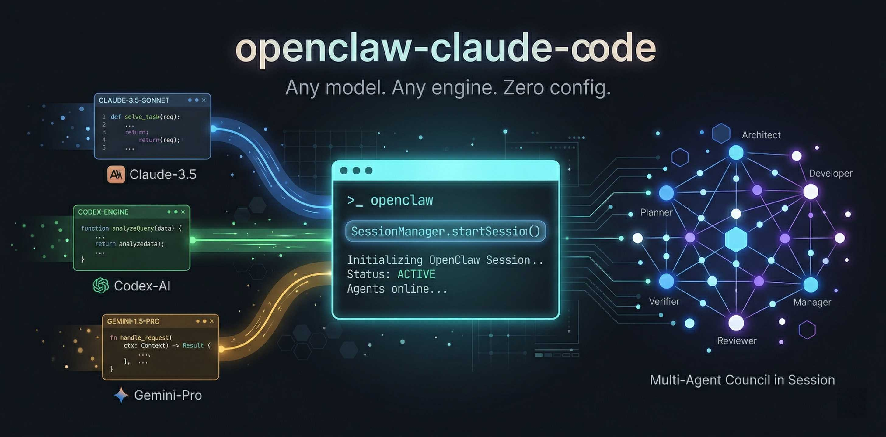

<p align="center">
  
</p>

# Claw Orchestrator

Run Claude Code, Codex and other coding agents in one unified runtime.

Claw Orchestrator turns interactive coding CLIs into programmable, headless agent engines. Start persistent sessions, route tasks across different coding agents, coordinate multi-agent councils, and expose everything through a clean tool-based API.

It's a TypeScript runtime for orchestrating Claude Code, OpenAI Codex, Gemini, Cursor Agent, and custom coding CLIs as persistent, programmable coding agents.

> Claude Code, Codex, Gemini, Cursor Agent, OpenCode, or your own custom CLI — orchestrated as one runtime.
>
> **Runs standalone, as an OpenClaw plugin, or as a Model Context Protocol (MCP) server — drop it into Hermes Agent, Claude Desktop, Cursor, Cline, Continue, Zed, Windsurf, Goose, or any MCP-compatible host.**

[](https://www.npmjs.com/package/@enderfga/claw-orchestrator)
[](https://github.com/Enderfga/claw-orchestrator/actions/workflows/ci.yml)
[](https://opensource.org/licenses/MIT)

---

## Why Claw Orchestrator?

Coding agents are powerful, but most are still designed as interactive CLIs.

That works well when a human is sitting in front of a terminal. It breaks down when you want agents to:

- keep long-running coding sessions alive
- switch between Claude Code, Codex, Gemini, Cursor Agent, OpenCode, or custom CLIs
- collaborate as a team on the same codebase
- integrate coding capabilities into OpenClaw first, and other claw-style agent systems over time
- manage context, tools, worktrees, and execution state programmatically

Claw Orchestrator is the control layer for that.

---

## Use Cases

- Run Claude Code or Codex as a headless coding agent
- Keep persistent AI coding sessions alive across requests
- Build multi-agent coding teams with isolated git worktrees
- Expose coding agents as MCP tools so Hermes Agent, Claude Desktop, Cursor, Cline, Continue, Zed, Windsurf, Goose, and other MCP-capable hosts can drive them
- Use the same toolset from OpenClaw, bots, dashboards, or custom runtimes
- Route tasks across Claude Code, Codex, Gemini, Cursor Agent, OpenCode, and custom CLIs

---

## Core Features

### Persistent Sessions

Keep coding agents alive across requests.

```ts
const session = await manager.startSession({
  name: "fix-tests",
  engine: "claude",
  cwd: "/path/to/project",
});

await manager.sendMessage("fix-tests", "Fix the failing tests");
```

### Multi-Engine Runtime

Drive different coding agents through one unified interface.

```ts
await manager.startSession({ name: "claude-task", engine: "claude" });
await manager.startSession({ name: "codex-task",  engine: "codex"  });
await manager.startSession({ name: "gemini-task", engine: "gemini" });
await manager.startSession({ name: "cursor-task", engine: "cursor" });
```

### Multi-Agent Council

Run multiple agents in parallel with isolated git worktrees, independent reasoning, and review-based collaboration.

```ts
await manager.councilStart("Design and implement an auth system", {
  agents: [
    { name: "Planner",  engine: "claude" },
    { name: "Builder",  engine: "codex"  },
    { name: "Reviewer", engine: "claude" },
  ],
});
```

### Autoloop (three-agent autonomous workspace iteration)

You converse with a long-lived **Planner** (Opus) to design `plan.md` and `goal.json`; on your "go" the Planner spawns a **Coder** (Sonnet) and a **Reviewer** (Sonnet, sandboxed cwd) into a self-iterating subloop. Coder applies changes + runs eval, Reviewer audits independently, ledger writes after every iter. The Planner pushes you (wechat → whatsapp → email fallback chain) on regression, target-hit, decision points, or a 30-min stall — silent otherwise.

```ts
await manager.autoloopStart({ runId: "my-run", workspace: "/path/to/repo" });
await manager.autoloopChat("my-run", "Read the workspace and design a plan to fix X");
// Planner reads files, drafts plan.md/goal.json, asks "ready to spawn?"
await manager.autoloopChat("my-run", "go");
// → Planner spawns Coder + Reviewer, subloop runs to target / max_iters / your terminate.
```

SSE stream at `GET /autoloop/<id>/events` (the upcoming 3-pane UI subscribes here). See [`skills/references/autoloop.md`](./skills/references/autoloop.md) for the full operator reference: tool list, push policy, ledger layout, smoke test.

### ultraapp (Forge tab — v0.5)

Turn a structured Q&A interview into a deployable web app. Open the dashboard's Forge tab, click `+ New`, walk through the AppSpec interview (Claude Opus asks one question per turn with recommended options), click `Start Build` to dispatch a 3-agent council that synthesises a complete codebase + a fix-on-failure helper that drives `npm install && npm run build && npm test && docker build .` to green, then watch the share card appear in chat with the live URL at `http://localhost:19000/forge/<slug>/`. A per-build Haiku narrator translates the structured event stream into short, language-matched chat updates so the user knows what's happening without reading raw event JSON. Sidebar items grow start/stop/delete controls; `Make Public…` shows copy-pastable Cloudflare Tunnel / ngrok / Tailscale / Caddy snippets so you can expose the app yourself. Post-deploy chat input is classified (cosmetic / spec-delta / structural) — cosmetic feedback runs the patcher (Opus diff + validate + auto-revert + version snapshot); spec-delta flips back to a focused interview; structural suggests a new run. v1.0 ships a reference-trace harness. See [`docs/superpowers/specs/2026-05-11-ultraapp-design.md`](./docs/superpowers/specs/2026-05-11-ultraapp-design.md).

### Tool Orchestration

Expose coding sessions as tools so other agents and systems can control them. The runtime registers 40 tools, including:

```txt
session_start         session_send         coding_session_status
session_grep          session_compact      session_inbox
team_send             team_list            coding_agents_list
council_start         council_review       council_accept
ultraplan_start       ultrareview_start
autoloop_start        autoloop_chat        autoloop_reset_agent
```

---

## Quick Start

### Standalone (no OpenClaw)

```bash
npm install -g @enderfga/claw-orchestrator
clawo serve
```

```bash
clawo session-start fix-tests --engine claude --cwd .
clawo session-send fix-tests "Fix the failing tests"
```

### Programmatic

```ts
import { SessionManager } from "@enderfga/claw-orchestrator";

const manager = new SessionManager();
await manager.startSession({ name: "task", cwd: "/project" });
const result = await manager.sendMessage("task", "Fix the failing tests");
```

### Run a multi-agent council

```bash
clawo council start "Refactor the API layer and add tests"
```

### As an OpenClaw plugin

If you run OpenClaw, Claw Orchestrator installs as a managed plugin. The same tools (`session_start`, `team_send`, `council_start`, ...) become available to every OpenClaw agent.

```bash
curl -fsSL https://raw.githubusercontent.com/Enderfga/claw-orchestrator/main/install.sh | bash
```

This installs via npm, registers the plugin in `~/.openclaw/openclaw.json`, and restarts the gateway. See [`skills/references/getting-started.md`](./skills/references/getting-started.md) for the full setup.

### As an MCP server (Hermes Agent, Claude Desktop, Cursor, Cline, Continue, Zed, Windsurf, Goose)

Every host that speaks the [Model Context Protocol](https://modelcontextprotocol.io) can pick up the orchestrator's full toolset (41 tools — sessions, council, ultraplan, ultrareview, autoloop, codex, inbox) over stdio.

```bash
npm install -g @enderfga/claw-orchestrator
# now `clawo-mcp` is on PATH
```

Register it with your host:

<details>
<summary><strong>Hermes Agent</strong> — <code>~/.hermes/config.yaml</code></summary>

```yaml
mcp_servers:
  clawo:
    command: clawo-mcp
    env:
      ANTHROPIC_API_KEY: "..."
      OPENAI_API_KEY: "..."
      GEMINI_API_KEY: "..."
    # Optional: keep the model focused — Hermes will surface only these
    tools:
      include: [mcp_clawo_session_start, mcp_clawo_session_send, mcp_clawo_council_start]
```
</details>

<details>
<summary><strong>Claude Desktop / Claude Code</strong> — <code>claude_desktop_config.json</code></summary>

```json
{
  "mcpServers": {
    "clawo": {
      "command": "clawo-mcp",
      "env": {
        "ANTHROPIC_API_KEY": "...",
        "OPENAI_API_KEY": "...",
        "CLAWO_MCP_TOOLS": "session_start,session_send,council_start,council_status,ultrareview_start"
      }
    }
  }
}
```
</details>

<details>
<summary><strong>Cursor / Cline / Continue / Zed / Windsurf / Goose</strong></summary>

Every one of these hosts speaks the standard MCP stdio config. Add `clawo-mcp` as a server with the same `command + args + env` shape — refer to your host's MCP documentation for the exact file path.
</details>

**Notes**

- Hosts prefix MCP tool names with the server slug (e.g. `mcp_clawo_session_start` in Hermes). The model sees the prefixed name; you don't need to call it manually.
- `CLAWO_MCP_TOOLS` (comma-separated allowlist) keeps the exposed surface tight when the host has a tight tool budget. Without it, all 41 tools are advertised.
- Hosts do not forward arbitrary shell env vars to MCP servers — list every API key your engines need (`ANTHROPIC_API_KEY`, `OPENAI_API_KEY`, `GEMINI_API_KEY`, etc.) explicitly under `env`.

Full reference: [`skills/references/mcp.md`](./skills/references/mcp.md).

---

## Engine Compatibility

| Engine | CLI | Tested Version | Status |
|--------|-----|----------------|--------|
| Claude Code   | `claude` | 2.1.126     | Supported |
| Codex         | `codex`  | 0.128.0     | Supported |
| Gemini        | `gemini` | 0.36.0      | Supported |
| Cursor Agent  | `agent`  | 2026.03.30  | Supported |
| OpenCode      | `opencode` | 1.1.40    | Supported |
| Custom CLI    | any      | —           | Supported |

Any coding CLI that can run as a subprocess can be integrated as a custom engine.

---

## Architecture

```txt
                 ┌─────────────────────┐
                 │  Claw Orchestrator  │
                 └──────────┬──────────┘
                            │
        ┌───────────────────┼───────────────────┐
        │                   │                   │
 ┌──────▼──────┐     ┌──────▼──────┐     ┌──────▼──────┐
 │ Claude Code │     │    Codex    │     │ Custom CLI  │
 └──────┬──────┘     └──────┬──────┘     └──────┬──────┘
        │                   │                   │
        └───────────┬───────┴───────────┬───────┘
                    │                   │
             Persistent Sessions   Tool API
                    │                   │
                    └──── Multi-Agent Council
```

For source-level architecture, see [`CLAUDE.md`](./CLAUDE.md). For deeper reference docs, see [`skills/references/`](./skills/references/).

---

## Migrating from v2.x

v3.x uses the Claw Orchestrator package, `clawo` CLI, and engine-neutral tool API. The v3.0 compatibility aliases were removed in v3.1.0.

| What | v2.x | Current |
|---|---|---|
| npm package | `@enderfga/openclaw-claude-code` | `@enderfga/claw-orchestrator` |
| CLI binary | `claude-code-skill` | `clawo` |
| Tool names | `claude_session_start`, `claude_session_send`, ... | `session_start`, `session_send`, ... |
| OpenClaw plugin id | `openclaw-claude-code` | `claw-orchestrator` |

To upgrade:

```bash
npm uninstall -g @enderfga/openclaw-claude-code
npm install -g @enderfga/claw-orchestrator
curl -fsSL https://raw.githubusercontent.com/Enderfga/claw-orchestrator/main/install.sh | bash
```

If your OpenClaw config still has an old plugin entry, remove it and register `claw-orchestrator`. Update scripts and tool callers before moving to v3.1.0 or newer.

---

## Project Status

Active development. Current focus areas:

- stable multi-engine session management
- richer council workflows
- custom engine configuration ergonomics
- runtime control APIs
- cleaner CLI and OpenClaw integration

---

## Contributing

See [`CONTRIBUTING.md`](./CONTRIBUTING.md). PR prefixes (`feat:`, `fix:`, `docs:`, `chore:`, `test:`) are required. Run `npm run build && npm run lint && npm run format:check && npm run test` before submitting.

---

## License

MIT — see [`LICENSE`](./LICENSE).
